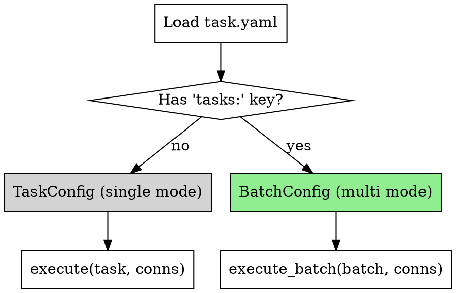

# Multi-Task YAML Design

**日期**：2026-07-17
**版本**：v0.4（在 v0.3 key regex transform 之后）
**状态**：设计已确认，待实现

## 背景

现有 `task.yaml` 是**单任务**结构：一份 YAML → 一次比对 → 一份报告。

真实场景（用户案例 `ManageOne原始数据.xlsx`）：
- 一个 Excel 文件里几十个 sheet
- 从第 2 页起，每个 sheet 是一张不同结构的表（不同字段、不同 keys）
- 每个 sheet 需要**独立比对**：主场景是 Excel-vs-GaussDB（同 DB 不同表），也可能是 Excel-vs-另一个 Excel-sheet、Excel-vs-HTTP API

当前 ExcelSource 的多 sheet 支持是"concat 成一张大表"（要求所有 sheet 表头一致），不适用于**每 sheet schema 不同**的场景。用户会不得不写几十份 task.yaml，右侧 connection 也要重复几十次。

本设计新增**多任务 YAML 模式**：一份 batch YAML 声明 N 个 sub-task，共享 defaults，各自独立比对，各自出报告，最后一份聚合日志。

## 需求范围

**In scope**：
- 一份 batch YAML 声明多个 sub-task，顺序执行
- 顶层 `defaults` 深度合并到每个 sub-task
- 每 sub-task 独立 sources / match / compare / output
- 支持 sub-task 完全覆盖 defaults 的 `type`（例：defaults `right.type=gaussdb`，sub-task `right.type=api`）
- `on_error: continue | fail_fast` 控制批次错误传播
- 每 sub-task 一个子目录 + 一份 `batch.log` 聚合元事件日志
- 单/多模式自动检测（有 `tasks:` 键则多，否则单），现有 task.yaml 零改动

**Out of scope（后续按需）**：
- 并行执行 sub-task（YAGNI，顺序够用）
- 目录批量模式（`datacompare batch <dir>/`）
- Sub-task 之间的数据依赖 / 结果传递
- 每 sub-task 独立的 `--param`
- 从命令行按名字挑选跑哪几个 sub-task
- Sub-task 之间共享 workbook cache（每 sub-task 独立 `ExcelSource`）

## 单/多模式检测



- 有 `tasks:` → 多任务模式；顶层字段视为 defaults
- 无 `tasks:` → 单任务模式（现有行为完全不变）
- 空 `tasks: []` → 加载报错（配了 batch 却没内容说明配错）

## 配置示例

```yaml
name: cmdb_multi_sync                    # 批次名（聚合日志、CLI 标题用）
description: CMDB 数据一致性核对
on_error: continue                       # continue（默认）| fail_fast

# 顶层字段 = defaults，被每个 sub-task 深度合并覆盖
sources:
  left:
    type: excel
    path: ManageOne原始数据.xlsx
  right:
    type: gaussdb
    connection: prod_cmdb
output:
  dir: ./reports
  formats: [html, json]
runtime:
  log_level: INFO

tasks:
  # A 场景：同 DB 不同表（共享 defaults）
  - name: physical_host
    sources:
      left:
        sheets: [{name: "CMDB系统_SYS_PHYSICALHOST"}]
      right:
        query: "SELECT id, name, host_ip FROM sys_physicalhost"
    match:
      keys: [{left: id, right: id}]
    compare:
      fields:
        - {left: name, right: name}
        - {left: hostIp, right: host_ip}

  - name: cloud_vm
    sources:
      left:
        sheets: [{name: "CMDB系统_CLOUD_VM"}]
      right:
        query: "SELECT id, name, ip_address FROM cloud_vm"
    match:
      keys: [{left: id, right: id}]
    compare:
      fields: [...]

  # A 变体：同 type 不同 connection
  - name: sync_from_backup
    sources:
      right:
        connection: backup_cmdb          # 覆盖 defaults 的 connection
        query: "SELECT ... FROM backup_meta"
      left:
        sheets: [{name: "BACKUP_META"}]
    match: {...}
    compare: {...}

  # 场景 C：sheet vs sheet（另一个 Excel）
  - name: cross_excel_check
    sources:
      right:
        type: excel                      # 覆盖 defaults 的 gaussdb
        path: snapshot.xlsx
        sheets: [{name: "COMPARE_A"}]
      left:
        sheets: [{name: "COMPARE_A"}]
    match: {...}
    compare: {...}

  # 场景 B：sheet vs API
  - name: vs_api_platform
    sources:
      right:
        type: api
        connection: cloud_platform
        url: /v1/vms
        pagination: {type: page, page_param: page, size_param: size, size: 200}
        data_path: $.data.list[*]
      left:
        sheets: [{name: "EXTERNAL_VMS"}]
    match: {...}
    compare: {...}
```

## 深度合并规则

**Dict**：递归合并；sub-task 键覆盖 defaults 键。
```
defaults:  {a: 1, b: {c: 2, d: 3}}
sub-task:  {b: {d: 4}}
merged:    {a: 1, b: {c: 2, d: 4}}
```

**List**：sub-task 有该字段就**整体替换**，不追加。
```
defaults:  {formats: [html, json]}
sub-task:  {formats: [csv]}
merged:    {formats: [csv]}     # 不是 [html, json, csv]
```

**Type 字段变化 → replace**：如果 sub-task 里某个嵌套 dict 的 `type` 字段与 defaults 不同（如 `right.type=gaussdb` → `right.type=api`），**丢弃 defaults 中该 dict 的所有其他字段**，只保留 sub-task 的。理由：`gaussdb.connection` 和 `api.url` 语义不通用，强行合并会造成非法配置。
```
defaults:  {right: {type: gaussdb, connection: prod, timeout: 30}}
sub-task:  {right: {type: api, url: /v1/vms}}
merged:    {right: {type: api, url: /v1/vms}}     # timeout 不保留
```

**None 显式覆盖**：sub-task 里显式写 `null` 视作"清除 defaults 值"，与"未写"不同。

**未提供的必填字段**：合并后走 Pydantic 校验；缺就报错。

## 文件系统布局

```
./reports/                           ← defaults.output.dir
├── batch.log                        ← 聚合日志（多任务模式独有）
├── physical_host/                   ← sub-task name
│   ├── report.html
│   ├── report.json
│   └── run-2026-07-17T02-30-00Z.log
├── cloud_vm/
│   ├── report.html
│   ├── report.json
│   └── run-2026-07-17T02-30-15Z.log
└── cross_excel_check/
    ├── report.html
    ├── report.json
    └── run-2026-07-17T02-30-30Z.log
```

**规则**：
- 每个 sub-task 目录 = `{defaults.output.dir}/{sub_task.name}/` **自动拼接**
- 若 sub-task **原始 dict 里显式写了** `output.dir` 键（合并前判断），**直接用它，不拼接**
  - 显式写的路径相对于 CWD（不是相对 defaults.output.dir）
  - 例：sub-task `output: {dir: /var/dumps/x}` → 用 `/var/dumps/x`；sub-task `output: {dir: ./x}` → 用 `./x`（相对 CWD）
- `output.formats` 和其他 `output.*` 字段走正常 deep-merge：sub-task 有就替换，没就继承
- Sub-task 内部结构与单任务模式完全一致：`report.*` + `run-{ts}.log`
- **聚合日志**固定名 `batch.log`，放 `defaults.output.dir` 根下

**Sub-task name 约束**：
- 每个 sub-task 必须有 `name`
- 全局唯一（否则子目录会撞）
- Pydantic validator 在加载阶段就报错

**聚合日志内容**（每行一条 structlog JSON）：
```json
{"event": "batch_start", "batch_name": "cmdb_multi_sync", "task_count": 5, "on_error": "continue", "timestamp": "..."}
{"event": "task_start", "task_name": "physical_host", "index": 1, "total": 5, "timestamp": "..."}
{"event": "task_end", "task_name": "physical_host", "status": "success", "matched": 500, "diff": 3, "left_only": 1, "right_only": 0, "duration_ms": 1234, "timestamp": "..."}
{"event": "task_end", "task_name": "cloud_vm", "status": "failed", "error_type": "KeyRegexMismatchError", "error_message": "...", "duration_ms": 56, "timestamp": "..."}
{"event": "batch_end", "batch_name": "cmdb_multi_sync", "success": 4, "failed": 1, "skipped": 0, "total_duration_ms": 5678, "timestamp": "..."}
```

- 聚合日志**只记元事件**（简洁，扫全景）
- Sub-task 详细日志（如 `key_regex_mismatch` 事件）仍在 `{sub_task}/run-{ts}.log`

## CLI 行为

**命令**：不新增子命令。`datacompare run task.yaml` 自动检测。

**控制台输出**：
```
▶ Batch: cmdb_multi_sync (5 tasks, on_error=continue)

[1/5] physical_host ......................... ✓ matched=500, diff=3 (1.2s)
[2/5] cloud_vm ............................. ✗ KeyRegexMismatchError: ...
[3/5] sync_from_backup ...................... ✓ matched=120, diff=0 (0.8s)
[4/5] cross_excel_check ..................... ✓ matched=45, diff=1 (0.3s)
[5/5] vs_api_platform ....................... ✓ matched=200, diff=0 (2.1s)

Summary: 4 succeeded, 1 failed, 0 skipped, total 5.7s
Reports: ./reports/
```

- 成功：`✓ matched=X, diff=Y (duration)`
- 失败：`✗ <ExceptionType>: <message truncated ~80 chars>`
- `fail_fast` 触发后剩余 sub-task 显示为 `- skipped`

**退出码**：

| 情况 | exit |
|---|---|
| 全部成功且无 diff（或未指定 `--fail-on-diff`）| 0 |
| 任何 sub-task 报 ConfigError | 1 |
| 任何 sub-task 报运行期错误（数据/连接/regex mismatch）| 2 |
| 全部成功但有 diff 且指定了 `--fail-on-diff` | 10 |
| 混合场景 | 优先级 **`2` > `10` > `1` > `0`** |

**`--dry-run`**：跑 Pydantic 校验 + defaults 合并 + 每个 sub-task 的完整校验，**不真跑比对**：
```
✓ Batch config valid (5 tasks)
  [1] physical_host — sources=(excel→gaussdb), keys=1, fields=8
  [2] cloud_vm — sources=(excel→gaussdb), keys=1, fields=6
  ...
```
任一 sub-task 校验失败 → exit 1，列出**所有**失败的 sub-task 及原因（不 fail-fast，一次改多个）。

**`--param`**：全局参数，应用到所有 sub-task 的模板渲染。sub-task 内不能各自定义参数（YAGNI）。

**`on_error` 位置**：**顶层**（与 defaults 平级），不放进 `runtime`。理由：这是批次级决策，不允许 sub-task 局部覆盖。

## 错误处理

| 错误来源 | on_error=continue | on_error=fail_fast |
|---|---|---|
| 加载阶段：YAML 解析、defaults 合并冲突、sub-task 唯一性冲突 | **立即中止**（不受 on_error 影响）| 同左 |
| Sub-task ConfigError（如引用不存在的 connection、sheet 名不存在）| 该 sub-task 记 failed，其他继续 | 立即停，exit 1 |
| Sub-task 运行错（数据源连接失败、regex mismatch、重复 key）| 该 sub-task 记 failed，其他继续 | 立即停，exit 2 |
| Sub-task 报告器写入失败 | 该 sub-task 记 failed，其他继续 | 立即停，exit 2 |
| Sub-task 内部意料之外的 Python 异常 | 该 sub-task 记 failed；`task_end` 事件带 `traceback` | 立即停 |

**要点**：
- 加载/校验错误**永远 fail-fast**（YAGNI）
- 运行错误才受 `on_error` 控制
- Sub-task 失败**不影响后续 sub-task 的 output 目录创建**

## 向后兼容

- 无 `tasks:` 键 → 现有 `load_task` 分支
- 有 `tasks:` 键 → 新 `load_batch` 分支
- 现有所有 task.yaml **零改动**继续工作
- 现有 `execute()` 签名不变，新增 `execute_batch()` 并列存在

## 契约签名

`src/datacompare/config/merge.py`（新文件）：

```python
def deep_merge(defaults: dict, overrides: dict) -> dict:
    """Merge overrides into defaults; overrides win.

    - Nested dicts: recursive merge.
    - Lists: overrides replace defaults (no concat).
    - Nested dict with 'type' key changing: overrides replace entire dict.
    - None in overrides explicitly clears defaults value.
    """


def merge_sub_task(defaults: dict, sub_task: dict) -> dict:
    """Produce a full TaskConfig dict for a sub-task by merging defaults."""
```

`src/datacompare/config/models.py`（追加）：

```python
class BatchTaskOverride(BaseModel):
    """Sub-task entry: partial fields that will be merged with defaults."""
    model_config = ConfigDict(extra="allow")
    name: str
    # Other fields are freeform dicts before merge, validated as TaskConfig after merge


class BatchConfig(BaseModel):
    model_config = ConfigDict(extra="forbid")
    name: str
    description: str = ""
    on_error: Literal["continue", "fail_fast"] = "continue"
    sources: dict | None = None       # defaults
    match: dict | None = None
    compare: dict | None = None
    output: dict | None = None
    runtime: dict | None = None
    tasks: list[BatchTaskOverride] = Field(min_length=1)

    @field_validator("tasks")
    def _unique_names(cls, v): ...
```

`src/datacompare/runner.py`（追加）：

```python
def execute_batch(batch: BatchConfig, conns: dict) -> BatchResult:
    """Run each sub-task in sequence; honor on_error; write batch.log."""


@dataclass
class BatchResult:
    batch_name: str
    task_results: list[SubTaskResult]
    total_duration_ms: int
    exit_code: int  # aggregate exit code per priority rules


@dataclass
class SubTaskResult:
    task_name: str
    status: Literal["success", "failed", "skipped"]
    comparison_result: ComparisonResult | None
    error: Exception | None
    duration_ms: int
```

`src/datacompare/config/loader.py`（追加）：

```python
def load_task_or_batch(path: Path, params: dict) -> TaskConfig | BatchConfig:
    """Load YAML; return BatchConfig if 'tasks:' key present, else TaskConfig."""
```

`src/datacompare/cli.py`（修改 `run` 命令）：分派 `execute` vs `execute_batch`；聚合日志文件配置；控制台批次输出格式。

## 影响面

**新增**：
- `src/datacompare/config/merge.py` — deep-merge 纯函数
- `src/datacompare/config/models.py` — `BatchConfig` + `BatchTaskOverride`
- `src/datacompare/engine/result.py` — `BatchResult` + `SubTaskResult`
- `src/datacompare/runner.py` — `execute_batch`
- 单元测试：`test_merge.py`、`test_batch_models.py`
- 集成测试：`test_batch_e2e.py`

**修改**：
- `src/datacompare/config/loader.py` — 加 `load_task_or_batch`
- `src/datacompare/cli.py` — `run` 命令分派
- `CLAUDE.md` — 加"批次模式"约束条
- `README.md`、`docs/user-guide.md` — 加用法示例
- `src/datacompare/templates/` — 加一个 `batch_example.yaml` 模板，`init` 命令支持

**基本不动**：
- `normalize/`、`engine/`、`sources/`、`reporters/` 完全不动
- 现有单任务测试完全不动

## 测试策略

### 单元测试

**`tests/unit/config/test_merge.py`**（新）—— 纯函数 deep-merge：
- dict 深合并
- 列表整个替换
- `None` 显式覆盖
- 嵌套 dict 部分覆盖
- `type` 字段变化时 replace

**`tests/unit/config/test_batch_models.py`**（新）—— Pydantic：
- `BatchConfig` `tasks` min_length=1
- `on_error` literal 校验
- Sub-task name 全局唯一
- Sub-task 缺字段能从 defaults 补齐；补不齐报错

**`tests/unit/config/test_loader.py`**（追加）—— 检测：
- 无 `tasks:` → `TaskConfig`
- 有 `tasks:` → `BatchConfig`
- 空 `tasks: []` → 报错

**`tests/unit/runner/test_batch.py`**（新）—— `execute_batch`：
- 全成功 → exit 0
- 一失败一成功 continue → exit 2，success_count=1
- fail_fast：第 2 个失败后不跑第 3 个
- 各 sub-task 的 output.dir 拼接正确
- Sub-task 显式 `output.dir` 时不拼接
- Sub-task type 覆盖时 defaults 被 replace

### 集成测试 `tests/integration/test_batch_e2e.py`（新）

**场景 A - 全成功**（3 个 sub-task，都对得上）
**场景 B - 混合失败 continue**（中间那个 regex mismatch）
**场景 C - fail_fast**（同 B 但 on_error=fail_fast）
**场景 D - `--dry-run`**（全通过 exit 0；一个缺字段全部列出）
**场景 E - 单/多模式自动检测**（同一份 YAML 加 `tasks:` 前后行为对比）
**场景 F - 覆盖 defaults**（sub-task `right.type` 从 gaussdb 换 api，缺字段 exit 1）

**场景 G - 混合右侧类型（核心真实场景）**：5 个 sub-task：
| sub-task | 左侧 | 右侧 |
|---|---|---|
| `sync_physical_host` | Excel `manage.xlsx#SYS_PHYSICALHOST` | GaussDB `SELECT ... FROM sys_physicalhost` |
| `sync_cloud_vm` | Excel `manage.xlsx#CLOUD_VM` | GaussDB `SELECT ... FROM cloud_vm` |
| `sync_from_backup` | Excel `manage.xlsx#BACKUP_META` | GaussDB 另一 connection 的 `backup_meta` |
| `cross_excel_check` | Excel `manage.xlsx#COMPARE_A` | 另一个 Excel `snapshot.xlsx#COMPARE_A` |
| `vs_api_platform` | Excel `manage.xlsx#EXTERNAL_VMS` | HTTP API `/v1/vms` |

断言：exit 0；5 个子目录都有 `report.json`；`batch.log` 有 5 条 success；defaults 合并对：1、2 共享 connection；3 覆盖 connection；4 覆盖整个 right 到 excel；5 覆盖整个 right 到 api。

**场景 H - 异构 + 部分失败**：同 G 结构，故意让 3 个失败：
- `sync_cloud_vm`：右侧 GaussDB 少一行 → 有 diff（不算失败）
- `cross_excel_check`：右侧 Excel 文件不存在 → FileNotFoundError → 失败
- `vs_api_platform`：API 返回 500 → 失败

断言：exit 2；5 个目录都建了；3 个成功的有完整报告；2 个失败的只有日志；`batch.log` 显示 3 success / 2 failed。

**场景 I - 同 Excel 内跨 sheet 互比**：
- `sub_task_1`：`manage.xlsx#SYS_PHYSICALHOST` vs `manage.xlsx#PHYSICALHOST_BACKUP`
- 验证：同一 Excel 文件被两个 sub-task 独立打开不串数据（workbook cache 生命周期）

### 向后兼容回归

跑现有全套测试确保 0 回归。特别关注：
- `test_cli_run_succeeds_with_key_regex`（单任务 CLI 全流程）
- `test_auto_log_file.py` 全部
- 现有 excel / gaussdb / api 各源的 e2e

### 覆盖率

- `config/merge.py` 100%
- `runner.py` 新增 `execute_batch` ≥90%
- `cli.py` 分派逻辑 100%

### 外部依赖

- GaussDB 真机：继续 testcontainers + Docker-gated skip
- HTTP API：`respx` mock

## 未来扩展路径

按需引入（不承诺时间表）：

1. **并行执行**：`runtime.parallel: 4` 声明并发数
2. **目录批量模式**：`datacompare batch tasks-dir/`
3. **命名选择**：`datacompare run batch.yaml --only physical_host,cloud_vm`
4. **Sub-task 参数覆盖**：每 sub-task 自己的 `params`
5. **依赖 & 结果传递**：sub-task 2 用 sub-task 1 的输出（复杂，YAGNI）
6. **共享 workbook cache**：多 sub-task 复用同一份 ExcelSource（性能优化）
